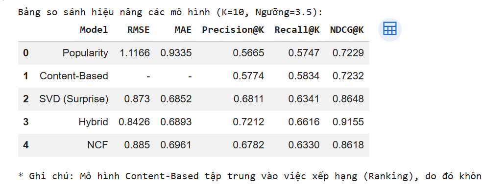

# MovieLens Recommender System: From Classical ML to Deep Learning 📌

## Overview
This project implements a comprehensive recommendation system using the MovieLens 1M dataset. It explores multiple approaches ranging from simple popularity baselines to advanced Neural Collaborative Filtering (NCF). 🚀

## Key Features
* **Exploratory Data Analysis (EDA):** Insights into user behavior and movie popularity.
* **Collaborative Filtering:** Memory-based (kNN) and Model-based (SVD) approaches.
* **Content-Based Filtering:** Leveraging movie genres for recommendations (Cold-start solution).
* **Hybrid Recommender:** Combining content-based and collaborative signals.
* **Neural Collaborative Filtering (NCF):** A deep learning approach using TensorFlow/Keras.
* **Evaluation:** Quantitative analysis using RMSE, MAE, Precision@K, Recall@K, and NDCG@K. 🛠️

## Tech Stack
* **Language:** Python
* **Libraries:** Pandas, NumPy, Scikit-learn, Scikit-Surprise, TensorFlow/Keras, Matplotlib, Seaborn

## Results Summary 📊

